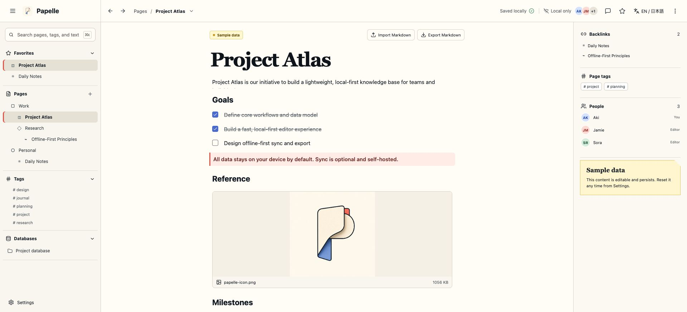
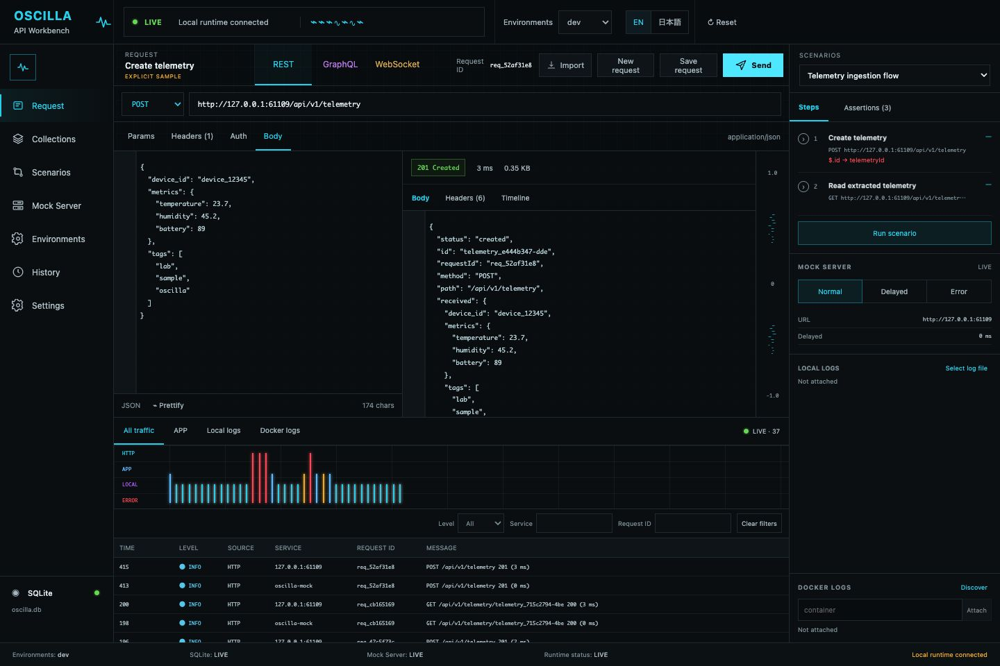
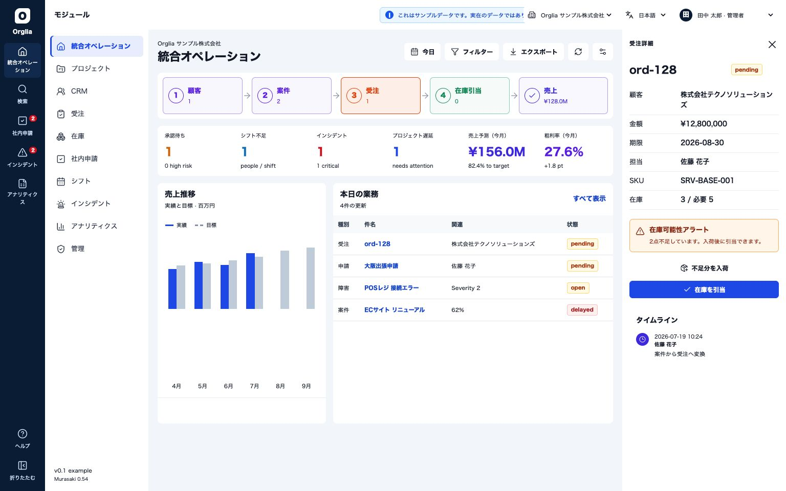

<div align="center">


**Next.js 開発者のためのデスクトップフレームワーク。**

React 19 · Vite · OS WebView · Rust ネイティブ · Chromium 不要

[](https://www.npmjs.com/package/murasaki)
[](https://www.npmjs.com/package/murasaki)
[](./LICENSE)
[](https://github.com/murasakijs/murasaki/actions/workflows/ci.yml)

[English](./README.md) · [日本語](./README.ja.md)

</div>

---

Murasaki は TypeScript ファーストのデスクトップフレームワークです。**Next.js ライクな DX**
——ファイルベースのプロジェクト構成、レイアウト、metadata、React 19 のサーバーアクション
——を **React 19 + Vite** の上に構築し、**マシンに標準搭載の OS WebView** でレンダリングします
(Chromium は同梱しません)。ネイティブウィンドウ、メニュー、OS 連携は自作の Rust バインディング
[`@murasakijs/native`](https://www.npmjs.com/package/@murasakijs/native) が担っており
——あなたが書くのは TypeScript だけで、Rust を書くことはありません。本番向けの
対応対象は **macOS / Windows / Linux** です(Linux は AppDir / `.AppImage` /
`.deb`、AppImage は self-update にも対応)。

```bash
npm create murasaki@latest my-app
cd my-app
npm run dev
```

```tsx
// src/app/page.tsx
import { useState } from 'react'
import { useContextMenu, Action } from 'murasaki'

export default function Page() {
  const [count, setCount] = useState(0)

  // The window-wide menu — declared as data, right next to your state.
  useContextMenu([
    { label: 'Increment', shortcut: 'command,I', action: () => setCount((n) => n + 1) },
    { separator: true },
    { label: 'Reload', shortcut: 'command,R', action: () => location.reload() },
    { label: 'Copy', action: <Action.Copy /> },
  ])

  return (
    <main>
      <h1>Hello, Murasaki 🦋</h1>
      <button onClick={() => setCount((n) => n + 1)}>Clicked {count} times</button>
    </main>
  )
}
```

`murasaki.config.ts` でそのレンダラーへ `menu:context` と
`clipboard:writeText` を付与してください。ネイティブメニューの各ロールは、対応する権限がない限り
拒否されます。

これは本物の Vite 開発サーバーが React Fast Refresh とともに動き、ネイティブウィンドウの中で
レンダリングされている状態です——そして画面のどこを右クリックしても、HTML のポップアップではなく
**本物の OS コンテキストメニュー**(macOS では NSMenu、Windows では HMENU)
が表示されます。

---

## 目次

- [クイックスタート](#クイックスタート)
- [サンプルアプリ](#サンプルアプリ)
- [なぜ murasaki なのか](#なぜ-murasaki-なのか)
- [機能](#機能)
- [CLI リファレンス](#cli-リファレンス)
- [署名と配布](#署名と配布)
- [設定 (`murasaki.config.ts`)](#設定-murasakiconfigts)
- [サーバーアクション](#サーバーアクション)
- [API ルート](#api-ルート)
- [アーキテクチャ](#アーキテクチャ)
- [ロードマップ](#ロードマップ)
- [コントリビュート](#コントリビュート)
- [行動規範](#行動規範)
- [セキュリティ](#セキュリティ)
- [ライセンス](#ライセンス)

---

## クイックスタート

```bash
# 雛形を生成
npm create murasaki@latest my-app

# Vite の HMR + React Fast Refresh で開発
cd my-app
npm run dev

# 配布（macOS、Windows、Linux に対応 — CLI リファレンス参照）
npm run build       # dist/client   Vite の本番ビルド
npm run bundle      # 選択したターゲット向けのポータブルなネイティブアプリ
npm run installer   # ターゲットに応じて .dmg、.zip/.exe/.msi、または .deb
```

生成される雛形は React 19 + Vite + Tailwind のアプリで、Next.js に近い構成です。
触るのは `src/app/`(ページ・レイアウト・`globals.css`)、`src/api/`(API ルート)、
`src/middleware.ts` だけ。`index.html` やエントリファイルの管理は
不要です — アプリシェルとクライアント起動は murasaki が持ちます(HTML の head を
カスタムしたい場合はプロジェクト直下に自分の `index.html` を置けます)。アプリの
識別情報とウィンドウ設定は `murasaki.config.ts` に記述します。

---

## サンプルアプリ

異なるプロダクト方向を検証する、ソース先行の3つの独立したアプリです。それぞれが専用の
ソース、アプリID、アイコン、永続化方式、要件マトリクスを持ちます。検証済みの範囲と残って
いるFramework／配布上の課題は、各アプリのREADMEで確認できます。

| アプリ | 実装例 | ソース |
| --- | --- | --- |
| **Papelle** | ブロック編集、Markdown、添付、ページ間リンク、データベース表示、任意のセルフホスト同期 | [`examples/papelle`](./examples/papelle) |
| **Oscilla** | REST／GraphQL／WebSocket、シナリオ、モック、通信タイムライン | [`examples/oscilla`](./examples/oscilla) |
| **Orglia** | CRM、プロジェクト、受発注、在庫、申請、シフト、インシデント、分析 | [`examples/orglia`](./examples/orglia) |

<p align="center">
  
  
  
</p>

現時点では、署名済みの一般利用者向けダウンロードとして案内していません。
[`examples/README.ja.md`](./examples/README.ja.md)に定めたクリーン環境でのインストール、
初回起動、更新、アンインストール検証が完了してから、再現可能な配布物を公開します。

---

## なぜ murasaki なのか

サイズ・メモリの話は各フレームワークが何を同梱しているかという話であり、横並びで
実測したベンチマーク値ではありません:

- **Electron** は各アプリに完全な Chromium **と** Node の両方を同梱します。
- **Tauri** は OS WebView でレンダリングし(Chromium なし)、ランタイムを一切
  同梱しません——フットプリントは最小ですが、バックエンドは Rust で書く必要があります。
- **murasaki** も OS WebView でレンダリングします(Chromium なし)が、Node を
  同梱することでアプリ全体——クライアントとサーバー側のロジック——を TypeScript
  のままにできます。

|                  | **murasaki**                    | Electron                | Tauri                  |
| ---------------- | -------------------------------- | ------------------------ | ------------------------ |
| レンダリング      | OS WebView (WKWebView / WebView2 / WebKitGTK) | 同梱 Chromium | OS WebView |
| ランタイム同梱    | Node.js                          | Chromium + Node          | なし                     |
| バックエンド言語  | TypeScript                       | TypeScript                | Rust                     |
| Rust を書く?      | いいえ (ビルド済みのネイティブバインディング) | いいえ         | はい                     |
| インストーラサイズ | **~43 MB `.dmg`** / **~120 MB `.app`** (macOS で実測) | ~80–150 MB\* | ~3–10 MB\* |
| npm エコシステム  | フル                              | フル                      | クライアントのみ         |
| サーバーアクション | `defineAction` / `useAction`     | 手動 IPC                  | 手動 IPC / コマンド      |
| 自動 publish CI   | Trusted Publisher OIDC           | 手動                      | 手動                     |

<sub>\* Electron/Tauri のインストーラでよく挙げられる概算値であり、当プロジェクトが実測したものではありません。murasaki の数値は macOS 上で実測した `.dmg`/`.app` の実サイズです。</sub>

### murasaki を選ぶ場合

- すでに **Next.js / React** を書いていて、Rust を学びたくない場合。
- プラットフォーム固有のコードを書かずに **ネイティブの OS コンテキストメニュー、
  メニュー、ダイアログ、通知** を使いたい場合。
- **Rust をまったく書かない** 代わりに Node が同梱されることを許容できる場合。

### Tauri を選ぶ場合

- 可能な限り小さいインストーラが必要で、バックエンドを **Rust** で書く覚悟がある場合。

### Electron を選ぶ場合

- インストールサイズを問わず、**Chromium が保証された環境**(特定の Web API や
  DevTools プロトコル)が必要な場合。

---

## 機能

- **Vite 開発サーバー + React Fast Refresh** — `murasaki dev` は Vite を起動し、
  そこを指すネイティブウィンドウを紐づけます。編集して保存すればウィンドウが更新されます。
- **ファイルベースルーティング** — `src/app/**/page.tsx` を置くだけでルートに
  なります。ネストされたレイアウト、動的な `:param` セグメント、`loading` /
  `error` / `not-found` バウンダリ、クライアントサイドの `<Link>` 遷移まで、
  ルーター設定を書く必要はありません。
- **メタデータ & ミドルウェア** — ページやレイアウトの `export const metadata` /
  `generateMetadata()` が document のタイトルと meta タグを設定し、
  `src/middleware.ts` が各ナビゲーションの前に走ってリダイレクトできます
  (ルートガード)。どちらも Next.js の形。
- **ネイティブコンテキストメニュー** — フックで宣言します。`useContextMenu([{ label,
  action, shortcut }])` — state の隣に置けるデータで、`action` は組み込みの
  `<Action.* />` 要素か自前の関数。id なしは全ウィンドウ、
  id を付けて領域を `<ContextMenuTrigger id>` で囲めばそこだけに適用。Rust 側へ post
  され、本物の OS メニュー(NSMenu / HMENU)が出ます。HTML のポップアップは
  介在しません。
- **ネイティブメニュー、ダイアログ、クリップボード、通知、シェル** —
  [`@murasakijs/native`](https://www.npmjs.com/package/@murasakijs/native) 上に
  構築されています。open/save/directory ダイアログ、クリップボードの読み書き、OS 通知、
  「Finder/Explorer で表示」などをすべて型付きで呼び出せ、呼び出しに Rust は不要です。
- **macOSメニューバーのステータス項目 / Windowsシステムトレイ** — process-wide
  icon、native nested menu、click / menu event、tooltip、動的icon / menu差し替えを
  renderer別capabilityの下で利用できます。
- **ユーザー単位のログイン時自動起動** — packaged macOS / Windows / Linux appで、
  型付きの`status` / `enable` / `disable`を使ったopt-in設定を提供できます。read / write
  権限は分離され、開発hostから永続的な登録は作れません。
- **macOSシステム権限** — camera / microphoneの用途説明と任意の起動時promptをconfigに
  宣言し、信頼済みrendererからcamera、microphone、screen recording、accessibilityの
  status取得 / requestができます。
- **Node Main lifecycleとhelper監視** — `src/main.ts`に長寿命TypeScriptを置き、`ready`、
  cancel可能な`beforeQuit`、上限付き`shutdown`、second instance / deep link配送、構造化log、
  diagnostic report、restart policy付きsidecarを利用できます。packaged hostはNodeの異常終了を
  検出し、process treeを停止して非ゼロ終了するため、backendが死んだUIを残しません。
- **宣言型multi-window runtime** — windowごとにrouteとdeny-by-default capabilityを設定し、
  secondary templateをNode Mainの`windows.create()`までdormantにできます。破棄・再生成と
  generation付きlifecycle eventに対応し、macOSでは`hud` / `sidebar` / `popover` vibrancyを
  native materialとして適用します。
- **本番向けsecurity primitive** — exact-origin native IPC、認証付きloopback endpoint、
  上限付きwire payload、CSP default、URL / path / window / permission scope、macOS Keychain /
  Windows Credential Manager、owner別global shortcut、app-wide private session / User-Agent /
  proxy設定を型付きで提供します。正確な成熟度と制約は
  [`capabilities.json`](./packages/murasaki/capabilities.json)を参照してください。
- **build-time plugin SDK** — trusted pluginからVite option、bundle dependency / resource、
  直列のdev / build / bundle hookを追加でき、Murasaki coreをpatchする必要はありません。
- **実際に動く Server Actions** — `defineAction` + `useAction` は React 19 の
  `useActionState` の形をそのまま踏襲し、`'use server'` 関数は実際に Node 上で
  実行されます——開発時は Vite ミドルウェア、本番時はバンドルされた Node の
  子サーバー経由です([サーバーアクション](#サーバーアクション) 参照)。
- **テーマ** — `ThemeProvider` / `useTheme` で light / dark / system モードに対応。
- **開発用エラーオーバーレイ** — キャッチされないランタイムエラー(レンダーエラー、
  未処理の Promise rejection)を、murasaki らしいフルスクリーンのオーバーレイとして
  スタックトレースと React のコンポーネントスタックとともに表示します。`Esc` で
  閉じるか、リロードできます。本番ビルドでは何もしません(no-op)。`murasaki dev`
  は `http://localhost` で配信されるため、標準の **React DevTools ブラウザ拡張**も
  同じ URL を Chrome で開けばそのまま使えます。
- **パッケージング** — `murasaki bundle` は macOS では `.app`、Windows では
  ポータブルなフォルダー / `.zip` を生成します。`murasaki installer` は macOS
  では `.dmg`、Windows では NSIS `.exe`(WiX があれば `.msi` も)を生成します。
  macOS の `.dmg` は圧縮後 ~43 MB、`.app` 自体は Node とアプリを同梱するため
  ~120 MB です。対応範囲は [プラットフォーム対応状況](#プラットフォーム対応状況)
  を参照してください。
- **自動アップデート** — 設定で `updater: true` にし、UI に `<UpdateButton />`
  (または `useUpdate()` フック)を置き、`murasaki release --manifest --sign` で
  公開します。アプリはマニフェストを取得して **Ed25519** 公開鍵で検証し、
  ダウンロードしたアセットの **SHA-256** を検証したうえで、自分自身を置き換えて
  再起動します。対応は macOS と Windows x64 です —
  [自動アップデート](https://murasaki.ichi10.com/ja/docs/guides/auto-update)
  を参照してください。
- **Deep Link とファイル関連付け** — `murasaki.config.ts` にカスタム URL scheme
  とドキュメント拡張子を宣言すると、macOS のパッケージと Windows の NSIS/MSI
  インストーラが OS に登録します。cold start と起動中の open は、型付きの Node Main
  `openRequested()` フックに統一して届きます。詳しくは
  [Deep Link とファイル関連付け](https://murasaki.ichi10.com/ja/docs/guides/deep-links)
  を参照してください。
- **Trusted Publisher OIDC** — タグの push をトリガーに署名付きの
  `npm publish --provenance` を実行します。CI に長期有効な npm トークンを
  置く必要はありません。

---

## CLI リファレンス

```
murasaki dev         Vite 開発サーバー + ネイティブウィンドウを起動 (HMR, Fast Refresh)
murasaki build       本番用 Vite ビルド → dist/client
murasaki bundle      現在のプラットフォーム向けのネイティブアプリフォルダ / .app
murasaki installer   現在のプラットフォーム向けの配布用インストーラ
murasaki init        Rust ツールチェーンをインストール (@murasakijs/native をいじる場合のみ)
murasaki icon        単一の PNG から Assets.car / .icns / .ico / .png を生成
murasaki release     自動アップデート用マニフェストのヘルパー
murasaki help        このヘルプを表示
```

### プラットフォーム対応状況

|                                | `dev` | `bundle`         | `installer`                       | 自動アップデート |
| ------------------------------ | :---: | ---------------- | --------------------------------- | :--------------: |
| **macOS**(arm64, x64)         |  ✅   | `.app`           | `.dmg` — macOS 上でビルドが必要   |       ✅         |
| **Windows**(x64)              |  ✅   | フォルダー / `.zip` | NSIS `.exe`¹、`.msi`²          |       ✅         |
| **Windows**(arm64)            |  ✅   | フォルダー / `.zip` | NSIS `.exe`¹                   |       ✅         |
| **Linux**(x64, arm64)         |  ✅   | AppDir + `.AppImage`³ | `.deb`³                      |      ✅⁴         |

<sub>¹ ビルドマシンに `makensis` が必要です(macOS / Linux からクロスコンパイルできます)。
² WiX v4 が必要で、Windows 上でビルドする必要があります。
³ `bundle` / `installer` は `.AppImage` の生成と任意ホストからのクロスビルドに
`mksquashfs`(`squashfs-tools`)が必要です。ネイティブランチャーは生成した
AppDir / `.AppImage` / `.deb` を実際に動かします(window、webview、
single-instance、deep link、crash reporting)。
⁴ AppImage のみです — self-update は実行中の `.AppImage` ファイル自体を
その場で journal 方式 swap し、`--appimage-extract-and-run` で再起動します
(FUSE 不要)。`.deb` でインストールした場合は swap できるファイルが無いため、
`check()` は system package manager が管理している旨を返します。</sub>

[`@murasakijs/native`](https://www.npmjs.com/package/@murasakijs/native) は
6 ターゲットすべてのビルド済みバイナリを同梱しているため、Rust ツールチェーンの
インストールは一切不要です。

**既知の制限(隠さず明記します):**

- **Linux には code signing、`.rpm`、repository metadata がありません。**
  AppDir / `.AppImage` / `.deb` はいずれも未署名で出荷され、Fedora/RHEL 向け
  パッケージや apt/dnf の repository index もまだありません。
- **Windows Authenticode には自分の証明書または署名プロバイダーが必要です。**
  `--sign` はアプリ実行ファイル、portable ZIP、NSIS setup、MSIを署名・検証しますが、
  Murasakiが発行元reputationを代行することはできません。新しい発行元では
  reputationが蓄積するまでSmartScreen警告が表示される場合があります。
- **macOS の署名と notarization には、ご自身の有料 Apple Developer ID が必要です** —
  [署名と配布](#署名と配布) を参照してください。既定は未署名です。
- **更新マニフェストの `mandatory` は助言的なフラグです。** murasaki はこのフラグを
  アプリに渡すだけで、ユーザーに更新を強制することはしません。

---

## 署名と配布

デフォルトでは、`murasaki bundle`/`murasaki installer` は**未署名**(ad-hoc)の
`.app`/`.dmg` を生成します。受け取った側は初回のみ右クリック→開く、または
`xattr -dr com.apple.quarantine "<path>"` を実行して開きます。

警告なしで配布するには、自分の Apple Developer ID で署名・公証します——
murasaki 自体は証明書を一切持ちません:

```
murasaki bundle --sign                 # .app を Developer ID で署名
murasaki installer --sign --notarize   # .dmg を Apple に提出して公証チケットをステープル
```

署名 identity は `$MURASAKI_SIGN_IDENTITY` → `config.sign.identity` →
キーチェーン内の最初の "Developer ID Application" identity の順で解決されます。
`--notarize` は `--sign` を必須とし、公証用の認証情報を `APPLE_ID` /
`APPLE_TEAM_ID` / `APPLE_APP_PASSWORD`(App 用パスワード)という環境変数から
読み取ります——設定ファイルやリポジトリには一切書きません。どちらも有料の
Apple Developer Program メンバーシップが必要です。

### GitHub Actions で署名リリース

タグを push すると `.dmg` をビルドして(secrets があれば署名 + notarize して)
GitHub Release に添付します。アプリに `.github/workflows/release.yml` として
追加:

```yaml
name: Release
on:
  push:
    tags: ['v*']
jobs:
  release:
    runs-on: macos-14
    permissions:
      contents: write
    steps:
      - uses: actions/checkout@v4
      - uses: pnpm/action-setup@v4
      - uses: actions/setup-node@v4
        with:
          node-version: 24
      - run: pnpm install
      - name: Import signing certificate
        if: ${{ secrets.APPLE_CERTIFICATE_P12 != '' }}
        env:
          CERT_P12: ${{ secrets.APPLE_CERTIFICATE_P12 }}
          CERT_PW: ${{ secrets.APPLE_CERTIFICATE_PASSWORD }}
        run: |
          KC="$RUNNER_TEMP/app.keychain-db"
          security create-keychain -p "" "$KC"
          security set-keychain-settings -lut 21600 "$KC"
          security unlock-keychain -p "" "$KC"
          echo "$CERT_P12" | base64 --decode > "$RUNNER_TEMP/cert.p12"
          security import "$RUNNER_TEMP/cert.p12" -k "$KC" -P "$CERT_PW" -T /usr/bin/codesign
          security set-key-partition-list -S apple-tool:,apple: -s -k "" "$KC"
          security list-keychains -d user -s "$KC" $(security list-keychains -d user | tr -d '"')
      - name: Build installer
        env:
          APPLE_ID: ${{ secrets.APPLE_ID }}
          APPLE_TEAM_ID: ${{ secrets.APPLE_TEAM_ID }}
          APPLE_APP_PASSWORD: ${{ secrets.APPLE_APP_PASSWORD }}
          HAS_CERT: ${{ secrets.APPLE_CERTIFICATE_P12 != '' }}
        run: |
          if [ "$HAS_CERT" = "true" ]; then
            pnpm exec murasaki installer --sign --notarize
          else
            pnpm exec murasaki installer
          fi
      - uses: softprops/action-gh-release@v2
        with:
          files: dist/*.dmg
```

署名 + notarize するには以下の repository secrets を追加(すべて省略すると
未署名 `.dmg`): `APPLE_CERTIFICATE_P12`(Developer ID の `.p12` を base64
化)、`APPLE_CERTIFICATE_PASSWORD`、`APPLE_ID`、`APPLE_TEAM_ID`、
`APPLE_APP_PASSWORD`。

---

## 設定 (`murasaki.config.ts`)

```ts
import { defineConfig } from 'murasaki'

export default defineConfig({
  appId: 'app.murasaki.example',
  productName: 'Murasaki App',
  version: '0.1.0',
  icon: 'assets/icon.png',
  window: {
    title: 'Murasaki App',
    width: 1000,
    height: 700,
  },
  protocols: [{ scheme: 'murasaki-app' }],
  fileAssociations: [{ extensions: ['murasaki'], role: 'editor' }],
})
```

`MurasakiConfig` はほかにも、オプションの `devPort`(Vite 開発サーバーのポート、
デフォルトは `5178`)、`targets`(ビルドターゲットの配列)、`protocols`、
`fileAssociations`、`updater`
— `useUpdate()` と `<UpdateButton />`(いずれも `murasaki` から)が参照する
自動更新の設定 — を受け付けます。

---

## サーバーアクション

React 19 スタイルのサーバーアクション——`useActionState` と同じ形です:

```ts
// src/actions.ts
'use server'
import { defineAction } from 'murasaki'
import type { ActionState } from 'murasaki'

export const greet = defineAction(
  async (_prev: ActionState<string>, formData: FormData): Promise<ActionState<string>> => {
    const name = formData.get('name')
    return { data: `Hello, ${name}!`, error: null, isPending: false }
  },
)
```

```tsx
// src/app/page.tsx
import { useAction } from 'murasaki'
import { greet } from '../actions'

export default function Home() {
  const [state, run, isPending] = useAction(greet, {
    data: null,
    error: null,
    isPending: false,
  })

  return (
    <form action={run}>
      <input name="name" />
      <button disabled={isPending}>Greet</button>
      {state.data && <p>{state.data}</p>}
    </form>
  )
}
```

`defineAction` は `'use server'` のセマンティクスを TypeScript の型情報として
そのまま運ぶ、型付きのパススルーです。`useAction` は React 19 の `useActionState`
を直接ラップしているため、`[state, run, isPending]` は Next.js ですでにおなじみの
形そのものです。Vite プラグインが `'use server'` ディレクティブを検出してモジュールを
分割します——クライアント側には型付きの `fetch` スタブが渡り、関数の実体はサーバー側
(開発時は Vite ミドルウェア、本番時は小さくバンドルされた Node の子サーバー)で
実行されます。

---

## API ルート

Next.js 風のファイルベース HTTP エンドポイント。`src/api/<path>/route.ts` が
HTTP メソッドごとに関数を export し、`/api/<path>` で配信されます:

```ts
// src/api/hello/route.ts  →  GET /api/hello
import type { RouteHandler } from 'murasaki'

export const GET: RouteHandler = async (request) => {
  return Response.json({ message: `Hello from Node ${process.version}` })
}

export const POST: RouteHandler = async (request) => {
  const body = await request.json()
  return Response.json({ received: body })
}
```

動的セグメントは `[name]` フォルダで表し、`context.params` に入ります:

```ts
// src/api/greet/[name]/route.ts  →  GET /api/greet/:name
import type { RouteHandler } from 'murasaki'

export const GET: RouteHandler = async (_request, { params }) => {
  return Response.json({ greeting: `Hello, ${params.name}!` })
}
```

ハンドラは Web 標準の `Request` を受け取り `Response` を返します(`Response.json`・
`new Response`・ステータス・ヘッダー、すべて標準)。dev(Vite ミドルウェア)でも
prod(同梱の Node サーバー)でもサーバー側で動くので、ファイルシステム・DB・
シークレットにアクセスできます。クライアントからは `fetch('/api/…')` で呼びます。

**API ルート vs サーバーアクション** — どちらもサーバー側で動きます。API ルートは
アドレス可能な HTTP エンドポイント(任意のクライアントが `fetch` でき、webhook や
外部呼び出し・REST 的な用途に向く)。サーバーアクションは React 19 のフォーム /
`useAction` フローに組み込まれた型付き RPC(URL 不要、`fetch` 不要)。両者は共存します。

---

## アーキテクチャ

```
┌─────────────────────────────────────────┐
│  あなたのアプリ (src/app/page.tsx, ...)  │  レイアウト, metadata, テーマ
├─────────────────────────────────────────┤
│  React 19 + Vite                        │  HMR, Fast Refresh, server-actions プラグイン
├─────────────────────────────────────────┤
│  murasaki (CLI + murasaki.config.ts)    │  dev / build / bundle / installer
├─────────────────────────────────────────┤
│  @murasakijs/native (Rust, via napi-rs) │  tao / wry / muda / rfd / arboard / notify-rust / open
├─────────────────────────────────────────┤
│  OS WebView                             │  WKWebView / WebView2 / WebKitGTK — Chromium は同梱しない
└─────────────────────────────────────────┘
```

---

## ロードマップ

murasaki は **pre-1.0** です——v1.0 までの間に API が変更される可能性があります。

- ✅ **Phase B** — App Router はほぼ完成: ルーティング・Server Actions・
  メタデータ・ミドルウェア・開発用エラーオーバーレイまで、すべて実装済みです。
- ✅ **Phase C** — `@murasakijs/ui` コンポーネントライブラリ、ドキュメントサイト、
  サンプル集。
- ✅ **Windows パッケージング** — ポータブル `.zip`、NSIS `.exe`、`.msi`。
  いずれも macOS / Linux からクロスコンパイルできます。
- ✅ **自動アップデート** — 署名付きマニフェスト、SHA-256 検証付きダウンロード、
  そのまま自分自身を置き換えて再起動。macOS、Windows x64 / arm64、Linux AppImage に
  対応しています。
- ✅ **Linux ディストリビューション** — AppDir + `.AppImage` と `.deb`。
  macOS / Windows / Linux からクロスコンパイルできます(`.AppImage` の生成には
  `mksquashfs` が必要)。ネイティブランチャーは生成した bundle を end-to-end で
  実際に動かし(window、webview、single-instance、deep link、crash
  reporting)、AppImage は self-update にも対応します。code signing、`.rpm`、
  repository metadata はまだありません。
- 🚧 **次にやること** — v1.0 の安定化と、対応するOS / architectureを横断する
  packaged app smoke testの拡充。
- 🔭 **検討中(post-1.0)**: サーバーサイドレンダリング + ストリーミング。現状の
  アーキテクチャはクライアント側で完結してレンダリングしているため、これは
  近いフェーズで計画しているものではなく、v1.0 以降に評価するより大きな
  アーキテクチャ上の変更として位置づけています。

---

## コントリビュート

コード、ドキュメント、サンプル、バグ報告、機能要望など、あらゆる貢献を歓迎します。
ワークフロー全体は [CONTRIBUTING.md](./CONTRIBUTING.md) を参照してください。

簡易セットアップ:

```bash
git clone https://github.com/murasakijs/murasaki.git
cd murasaki
pnpm install
pnpm --filter murasaki build

# ネイティブバインディング (Rust) をいじる場合のみ——ほとんどのコントリビュータには不要
pnpm --filter @murasakijs/native build
# または: cd crates/native && pnpm build
```

## 行動規範

本プロジェクトは Contributor Covenant に従います。参加する前に
[CODE_OF_CONDUCT.md](./CODE_OF_CONDUCT.md) をお読みください。

## セキュリティ

セキュリティ上の問題は **公開の GitHub Issue で報告しないでください**。
責任ある報告方法については [SECURITY.md](./SECURITY.md) を参照してください。

## ライセンス

MIT © ichi — [LICENSE](./LICENSE) を参照。
</content>
</invoke>
