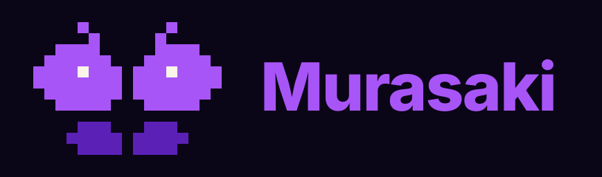

<div align="center">



**Next.js 開発者のためのデスクトップフレームワーク。**

React 19 · Vite · OS WebView · Rust ネイティブ · Chromium 不要

[](https://www.npmjs.com/package/murasaki)
[](https://www.npmjs.com/package/murasaki)
[](./LICENSE)
[](https://github.com/murasakijs/murasaki/actions)

[English](./README.md) · [日本語](./README.ja.md)

</div>

---

Murasaki は TypeScript ファーストのデスクトップフレームワークです。**Next.js ライクな DX**
——ファイルベースのプロジェクト構成、レイアウト、metadata、React 19 のサーバーアクション
——を **React 19 + Vite** の上に構築し、**マシンに標準搭載の OS WebView** でレンダリングします
(Chromium は同梱しません)。ネイティブウィンドウ、メニュー、OS 連携は自作の Rust バインディング
[`@murasakijs/native`](https://www.npmjs.com/package/@murasakijs/native) が担っており
——あなたが書くのは TypeScript だけで、Rust を書くことはありません。対応ターゲットは
**macOS / Windows / Linux** です。

```bash
npm create murasaki@latest my-app
cd my-app
npm run dev
```

```tsx
// src/app/page.tsx
import { useState } from 'react'
import { useContextMenu, Action } from 'murasaki'

export default function Page() {
  const [count, setCount] = useState(0)

  // The window-wide menu — declared as data, right next to your state.
  useContextMenu([
    { label: 'Increment', shortcut: 'command,I', action: () => setCount((n) => n + 1) },
    { separator: true },
    { label: 'Reload', shortcut: 'command,R', action: () => location.reload() },
    { label: 'Copy', action: <Action.Copy /> },
  ])

  return (
    <main>
      <h1>Hello, Murasaki 🦋</h1>
      <button onClick={() => setCount((n) => n + 1)}>Clicked {count} times</button>
    </main>
  )
}
```

これは本物の Vite 開発サーバーが React Fast Refresh とともに動き、ネイティブウィンドウの中で
レンダリングされている状態です——そして画面のどこを右クリックしても、HTML のポップアップではなく
**本物の OS コンテキストメニュー**(macOS では NSMenu、Windows では HMENU、Linux では GtkMenu)
が表示されます。

---

## 目次

- [クイックスタート](#クイックスタート)
- [なぜ murasaki なのか](#なぜ-murasaki-なのか)
- [機能](#機能)
- [CLI リファレンス](#cli-リファレンス)
- [設定 (`murasaki.config.ts`)](#設定-murasakiconfigts)
- [サーバーアクション](#サーバーアクション)
- [API ルート](#api-ルート)
- [アーキテクチャ](#アーキテクチャ)
- [ロードマップ](#ロードマップ)
- [コントリビュート](#コントリビュート)
- [行動規範](#行動規範)
- [セキュリティ](#セキュリティ)
- [ライセンス](#ライセンス)

---

## クイックスタート

```bash
# 雛形を生成
npm create murasaki@latest my-app

# Vite の HMR + React Fast Refresh で開発
cd my-app
npm run dev

# 配布 (現時点では macOS で検証済み — CLI リファレンス参照)
npm run build       # dist/client            Vite の本番ビルド
npm run bundle      # dist/bundle/<App>.app  ~120 MB (Node + アプリを同梱)
npm run installer   # dist/<App>-<ver>.dmg   ~43 MB (圧縮後)
```

生成される雛形は React 19 + Vite + Tailwind のアプリで、Next.js に近い構成です。
触るのは `src/app/`(ページ・レイアウト・`globals.css`)、`src/api/`(API ルート)、
`src/middleware.ts` だけ。`index.html` やエントリファイルの管理は
不要です — アプリシェルとクライアント起動は murasaki が持ちます(HTML の head を
カスタムしたい場合はプロジェクト直下に自分の `index.html` を置けます)。アプリの
識別情報とウィンドウ設定は `murasaki.config.ts` に記述します。

---

## なぜ murasaki なのか

サイズ・メモリの話は各フレームワークが何を同梱しているかという話であり、横並びで
実測したベンチマーク値ではありません:

- **Electron** は各アプリに完全な Chromium **と** Node の両方を同梱します。
- **Tauri** は OS WebView でレンダリングし(Chromium なし)、ランタイムを一切
  同梱しません——フットプリントは最小ですが、バックエンドは Rust で書く必要があります。
- **murasaki** も OS WebView でレンダリングします(Chromium なし)が、Node を
  同梱することでアプリ全体——クライアントとサーバー側のロジック——を TypeScript
  のままにできます。

|                  | **murasaki**                    | Electron                | Tauri                  |
| ---------------- | -------------------------------- | ------------------------ | ------------------------ |
| レンダリング      | OS WebView (WKWebView / WebView2 / WebKitGTK) | 同梱 Chromium | OS WebView |
| ランタイム同梱    | Node.js                          | Chromium + Node          | なし                     |
| バックエンド言語  | TypeScript                       | TypeScript                | Rust                     |
| Rust を書く?      | いいえ (ビルド済みのネイティブバインディング) | いいえ         | はい                     |
| インストーラサイズ | **~43 MB `.dmg`** / **~120 MB `.app`** (macOS で実測) | ~80–150 MB\* | ~3–10 MB\* |
| npm エコシステム  | フル                              | フル                      | クライアントのみ         |
| サーバーアクション | `defineAction` / `useAction`     | 手動 IPC                  | 手動 IPC / コマンド      |
| 自動 publish CI   | Trusted Publisher OIDC           | 手動                      | 手動                     |

<sub>\* Electron/Tauri のインストーラでよく挙げられる概算値であり、当プロジェクトが実測したものではありません。murasaki の数値は macOS 上で実測した `.dmg`/`.app` の実サイズです。</sub>

### murasaki を選ぶ場合

- すでに **Next.js / React** を書いていて、Rust を学びたくない場合。
- プラットフォーム固有のコードを書かずに **ネイティブの OS コンテキストメニュー、
  メニュー、ダイアログ、通知** を使いたい場合。
- **Rust をまったく書かない** 代わりに Node が同梱されることを許容できる場合。

### Tauri を選ぶ場合

- 可能な限り小さいインストーラが必要で、バックエンドを **Rust** で書く覚悟がある場合。

### Electron を選ぶ場合

- インストールサイズを問わず、**Chromium が保証された環境**(特定の Web API や
  DevTools プロトコル)が必要な場合。

---

## 機能

- **Vite 開発サーバー + React Fast Refresh** — `murasaki dev` は Vite を起動し、
  そこを指すネイティブウィンドウを紐づけます。編集して保存すればウィンドウが更新されます。
- **ファイルベースルーティング** — `src/app/**/page.tsx` を置くだけでルートに
  なります。ネストされたレイアウト、動的な `:param` セグメント、`loading` /
  `error` / `not-found` バウンダリ、クライアントサイドの `<Link>` 遷移まで、
  ルーター設定を書く必要はありません。
- **メタデータ & ミドルウェア** — ページやレイアウトの `export const metadata` /
  `generateMetadata()` が document のタイトルと meta タグを設定し、
  `src/middleware.ts` が各ナビゲーションの前に走ってリダイレクトできます
  (ルートガード)。どちらも Next.js の形。
- **ネイティブコンテキストメニュー** — フックで宣言します。`useContextMenu([{ label,
  action, shortcut }])` — state の隣に置けるデータで、`action` は組み込みの
  `<Action.* />` 要素か自前の関数。id なしは全ウィンドウ、
  id を付けて領域を `<ContextMenuTrigger id>` で囲めばそこだけに適用。Rust 側へ post
  され、本物の OS メニュー(NSMenu / HMENU / GtkMenu)が出ます。HTML のポップアップは
  介在しません。
- **ネイティブメニュー、ダイアログ、クリップボード、通知、シェル** —
  [`@murasakijs/native`](https://www.npmjs.com/package/@murasakijs/native) 上に
  構築されています。open/save/directory ダイアログ、クリップボードの読み書き、OS 通知、
  「Finder/Explorer で表示」などをすべて型付きで呼び出せ、呼び出しに Rust は不要です。
- **実際に動く Server Actions** — `defineAction` + `useAction` は React 19 の
  `useActionState` の形をそのまま踏襲し、`'use server'` 関数は実際に Node 上で
  実行されます——開発時は Vite ミドルウェア、本番時はバンドルされた Node の
  子サーバー経由です([サーバーアクション](#サーバーアクション) 参照)。
- **テーマ** — `ThemeProvider` / `useTheme` で light / dark / system モードに対応。
- **開発用エラーオーバーレイ** — キャッチされないランタイムエラー(レンダーエラー、
  未処理の Promise rejection)を、murasaki らしいフルスクリーンのオーバーレイとして
  スタックトレースと React のコンポーネントスタックとともに表示します。`Esc` で
  閉じるか、リロードできます。本番ビルドでは何もしません(no-op)。`murasaki dev`
  は `http://localhost` で配信されるため、標準の **React DevTools ブラウザ拡張**も
  同じ URL を Chrome で開けばそのまま使えます。
- **macOS でのパッケージング(検証済み)** — `murasaki bundle` → `.app`、
  `murasaki installer` → `.dmg`(圧縮後 ~43 MB。`.app` 自体は Node + アプリを
  同梱するため ~120 MB)。
- **Trusted Publisher OIDC** — タグの push をトリガーに署名付きの
  `npm publish --provenance` を実行します。CI に長期有効な npm トークンを
  置く必要はありません。

---

## CLI リファレンス

```
murasaki dev         Vite 開発サーバー + ネイティブウィンドウを起動 (HMR, Fast Refresh)
murasaki build       本番用 Vite ビルド → dist/client
murasaki bundle      現在のプラットフォーム向けのネイティブアプリフォルダ / .app
murasaki installer   現在のプラットフォーム向けの配布用インストーラ
murasaki init        Rust ツールチェーンをインストール (@murasakijs/native をいじる場合のみ)
murasaki icon        単一の PNG から .icns / .ico / .png を生成
murasaki release     自動アップデート用マニフェストのヘルパー
murasaki help        このヘルプを表示
```

**プラットフォームの状況:** `murasaki dev` は macOS、Windows、Linux で動作します。
`murasaki bundle` と `murasaki installer` は現在 **macOS**(`.app` / `.dmg`)で
実装・検証済みです。それ以外のプラットフォームでは、現時点ではインストーラを生成する
代わりに "not supported yet" というメッセージを表示します。
[`@murasakijs/native`](https://www.npmjs.com/package/@murasakijs/native) 自体は
すでに macOS(arm64/x64)、Windows(x64)、Linux(x64/arm64)向けのビルド済み
バイナリを提供しています——Windows/Linux 向けアプリパッケージングは
[ロードマップ](#ロードマップ) で管理しています。

---

## 設定 (`murasaki.config.ts`)

```ts
import { defineConfig } from 'murasaki'

export default defineConfig({
  appId: 'app.murasaki.example',
  productName: 'Murasaki App',
  version: '0.1.0',
  icon: 'assets/icon.png',
  window: {
    title: 'Murasaki App',
    width: 1000,
    height: 700,
  },
})
```

`MurasakiConfig` はほかにも、オプションの `devPort`(Vite 開発サーバーのポート、
デフォルトは `5178`)、`targets`(ビルドターゲットの配列)、`updater`
(`useUpdate` / `UpdateButton` が参照する設定)を受け付けます。

---

## サーバーアクション

React 19 スタイルのサーバーアクション——`useActionState` と同じ形です:

```ts
// src/actions.ts
'use server'
import { defineAction } from 'murasaki'
import type { ActionState } from 'murasaki'

export const greet = defineAction(
  async (_prev: ActionState<string>, formData: FormData): Promise<ActionState<string>> => {
    const name = formData.get('name')
    return { data: `Hello, ${name}!`, error: null, isPending: false }
  },
)
```

```tsx
// src/app/page.tsx
import { useAction } from 'murasaki'
import { greet } from '../actions'

export default function Home() {
  const [state, run, isPending] = useAction(greet, {
    data: null,
    error: null,
    isPending: false,
  })

  return (
    <form action={run}>
      <input name="name" />
      <button disabled={isPending}>Greet</button>
      {state.data && <p>{state.data}</p>}
    </form>
  )
}
```

`defineAction` は `'use server'` のセマンティクスを TypeScript の型情報として
そのまま運ぶ、型付きのパススルーです。`useAction` は React 19 の `useActionState`
を直接ラップしているため、`[state, run, isPending]` は Next.js ですでにおなじみの
形そのものです。Vite プラグインが `'use server'` ディレクティブを検出してモジュールを
分割します——クライアント側には型付きの `fetch` スタブが渡り、関数の実体はサーバー側
(開発時は Vite ミドルウェア、本番時は小さくバンドルされた Node の子サーバー)で
実行されます。

---

## API ルート

Next.js 風のファイルベース HTTP エンドポイント。`src/api/<path>/route.ts` が
HTTP メソッドごとに関数を export し、`/api/<path>` で配信されます:

```ts
// src/api/hello/route.ts  →  GET /api/hello
import type { RouteHandler } from 'murasaki'

export const GET: RouteHandler = async (request) => {
  return Response.json({ message: `Hello from Node ${process.version}` })
}

export const POST: RouteHandler = async (request) => {
  const body = await request.json()
  return Response.json({ received: body })
}
```

動的セグメントは `[name]` フォルダで表し、`context.params` に入ります:

```ts
// src/api/greet/[name]/route.ts  →  GET /api/greet/:name
import type { RouteHandler } from 'murasaki'

export const GET: RouteHandler = async (_request, { params }) => {
  return Response.json({ greeting: `Hello, ${params.name}!` })
}
```

ハンドラは Web 標準の `Request` を受け取り `Response` を返します(`Response.json`・
`new Response`・ステータス・ヘッダー、すべて標準)。dev(Vite ミドルウェア)でも
prod(同梱の Node サーバー)でもサーバー側で動くので、ファイルシステム・DB・
シークレットにアクセスできます。クライアントからは `fetch('/api/…')` で呼びます。

**API ルート vs サーバーアクション** — どちらもサーバー側で動きます。API ルートは
アドレス可能な HTTP エンドポイント(任意のクライアントが `fetch` でき、webhook や
外部呼び出し・REST 的な用途に向く)。サーバーアクションは React 19 のフォーム /
`useAction` フローに組み込まれた型付き RPC(URL 不要、`fetch` 不要)。両者は共存します。

---

## アーキテクチャ

```
┌─────────────────────────────────────────┐
│  あなたのアプリ (src/app/page.tsx, ...)  │  レイアウト, metadata, テーマ
├─────────────────────────────────────────┤
│  React 19 + Vite                        │  HMR, Fast Refresh, server-actions プラグイン
├─────────────────────────────────────────┤
│  murasaki (CLI + murasaki.config.ts)    │  dev / build / bundle / installer
├─────────────────────────────────────────┤
│  @murasakijs/native (Rust, via napi-rs) │  tao / wry / muda / rfd / arboard / notify-rust / open
├─────────────────────────────────────────┤
│  OS WebView                             │  WKWebView / WebView2 / WebKitGTK — Chromium は同梱しない
└─────────────────────────────────────────┘
```

---

## ロードマップ

murasaki は **pre-1.0**(現在 `0.34.5`)です——v1.0 までの間に API が変更される
可能性があります。

- ✅ **Phase B** — App Router はほぼ完成: ルーティング・Server Actions・
  メタデータ・ミドルウェア・開発用エラーオーバーレイまで、すべて実装済みです。
- 🚧 **Phase C** — `@murasakijs/ui` コンポーネントライブラリ、ドキュメントサイト、
  サンプル集。
- 🚧 **Phase D** — 自動アップデート、コード署名 / notarization、Windows/Linux
  パッケージング、v1.0 の安定化。
- 🔭 **検討中(post-1.0)**: サーバーサイドレンダリング + ストリーミング。現状の
  アーキテクチャはクライアント側で完結してレンダリングしているため、これは
  近いフェーズで計画しているものではなく、v1.0 以降に評価するより大きな
  アーキテクチャ上の変更として位置づけています。

---

## コントリビュート

コード、ドキュメント、サンプル、バグ報告、機能要望など、あらゆる貢献を歓迎します。
ワークフロー全体は [CONTRIBUTING.md](./CONTRIBUTING.md) を参照してください。

簡易セットアップ:

```bash
git clone https://github.com/murasakijs/murasaki.git
cd murasaki
pnpm install
pnpm --filter murasaki build

# ネイティブバインディング (Rust) をいじる場合のみ——ほとんどのコントリビュータには不要
pnpm --filter @murasakijs/native build
# または: cd crates/native && pnpm build
```

## 行動規範

本プロジェクトは Contributor Covenant に従います。参加する前に
[CODE_OF_CONDUCT.md](./CODE_OF_CONDUCT.md) をお読みください。

## セキュリティ

セキュリティ上の問題は **公開の GitHub Issue で報告しないでください**。
責任ある報告方法については [SECURITY.md](./SECURITY.md) を参照してください。

## ライセンス

MIT © ichi — [LICENSE](./LICENSE) を参照。
</content>
</invoke>
