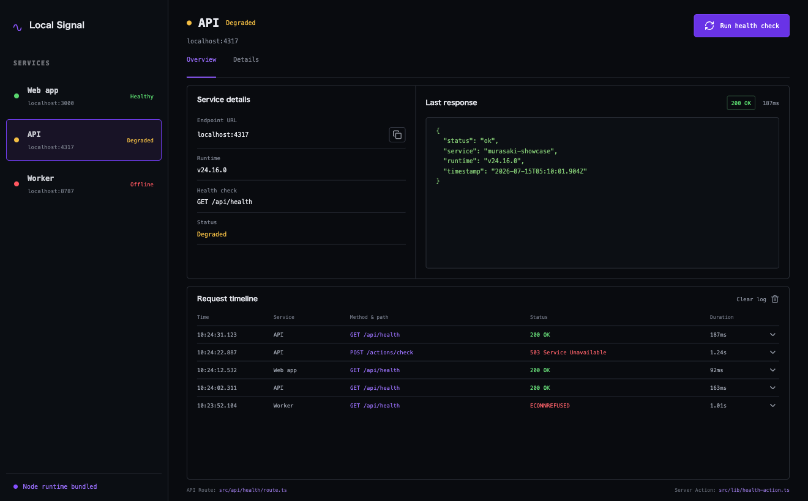

# Local Signal

A developer service monitor proving that Murasaki can keep server-side TypeScript in a desktop app.



- `GET /api/health` API Route
- `runHealthCheck` Server Action
- Bundled Node runtime in production
- Working request log and clipboard action

```bash
pnpm --filter local-signal dev
pnpm --filter local-signal installer
```

This app owns its `js.murasaki.examples.localsignal` identity and dedicated
Signal icon; it is packaged independently from the other examples.

The implementation follows [`design/concept.png`](./design/concept.png).
