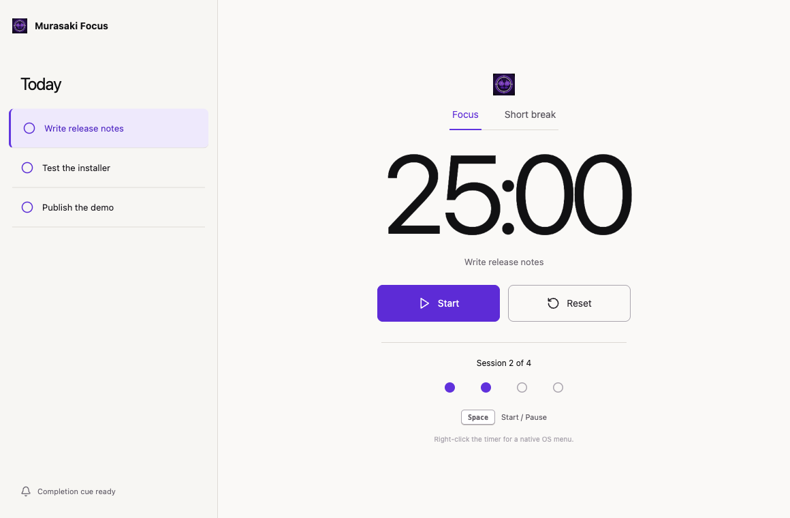

# Murasaki Focus

A keyboard-first focus timer showing a light, consumer-style Murasaki desktop app.



- Persistent task and timer state
- Native app and context menus
- Keyboard-driven start/pause control
- React state and accessible reduced-motion behavior

```bash
pnpm --filter murasaki-focus dev
pnpm --filter murasaki-focus installer
```

This app owns its `js.murasaki.examples.focus` identity and dedicated Focus
icon; it is packaged independently from the other examples.

The implementation follows [`design/concept.png`](./design/concept.png).
