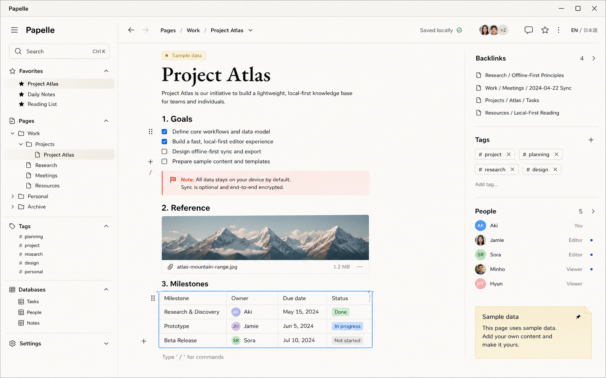

# Papelle

Papelle is a local-first personal knowledge workspace built from scratch as a
production-oriented Murasaki proof. It intentionally does not reuse any code,
data model, styling, or copy from the previous sample applications.



## What this vertical slice proves

- A Notion-inspired block editor with text, headings, tasks, callouts, image
  and audio previews, plus downloadable PDF attachments.
- Durable local persistence through Node Main, `'use main'`, and Node's built-in
  SQLite (`node:sqlite`). Renderer state is optimistic and remains editable
  while the optional sync service is offline.
- Markdown import/export with tested title, heading, callout, and task
  round-tripping.
- Page hierarchy, favorites, tags, full-workspace search, wiki links, and
  backlinks.
- One data collection shown as an editable table, kanban board, or calendar.
- English/Japanese UI switching and keyboard-first actions (`Cmd/Ctrl+K`,
  `Cmd/Ctrl+N`, `Cmd/Ctrl+S`).
- Native application and context menus with an explicit renderer capability
  allowlist.
- A Docker Compose self-host stack: PostgreSQL plus an authenticated, bounded
  WebSocket sync server. The protocol uses monotonic server revisions,
  base-revision conflict detection, reconnect handshakes, and deterministic
  three-way merge. It is not a CRDT and concurrent edits to the same scalar
  field resolve deterministically rather than preserving both values.
- Explicit sample data, an empty state, reset controls, and a non-destructive
  no-sample launch profile.

## Run

```bash
pnpm --filter papelle dev
```

Start the optional self-hosted collaboration service:

```bash
cd examples/papelle
cp .env.example .env
# Replace both token values with the same random value (at least 16 characters).
docker compose up --build
pnpm dev
```

Start empty during development:

```bash
pnpm --filter papelle dev -- --no-sample-data
```

Empty launches use a separate `empty-session` SQLite row and never overwrite
the primary workspace. Packaged cold-start flags arrive through
`MainContext.launch.argv`; `murasaki dev -- <app args>` forwards the same flag
path in development without leaking the CLI's own arguments.

## Evidence used before implementation

The implementation was planned from the checked-in AI reference rather than
assumed Next.js or Electron behavior:

- `packages/mcp/src/knowledge.mjs` was invoked for `search_docs`,
  `get_api_reference`, `get_config_schema`, `list_recipes`, and
  `check_compatibility`.
- `apps/docs/lib/llms.ts` defines `/llms.txt`, `/llms-full.txt`, and
  `/llms-api.txt`; its rule that `planned` is unavailable and `partial` /
  `experimental` limitations remain normative was applied literally.
- `packages/murasaki/capabilities.json` is the canonical maturity manifest for
  Murasaki 0.55.0.

The MCP compatibility result for Papelle's core set was **limited**. That is
expected: Node Main is experimental, native utilities and menus are partial,
and Linux Node Main/file routing is development-only.

## Requirement matrix

| Requirement | Vertical slice | Murasaki evidence / limitation | Next stage |
| --- | --- | --- | --- |
| Local-first storage | **Working**: SQLite WAL database under `MainContext.paths.data` | Node Main is **experimental**; macOS/Windows supported, Linux development-only | Normalize data instead of storing one bounded JSON document; add migration and recovery tests |
| Block editor | **Working vertical path**: heading, text, task, callout and attachment blocks; split/backspace navigation; drag and keyboard reorder; slash conversion; deletion undo | Renderer is React/Vite; no RSC or Next editor runtime is assumed | Add inline marks, multi-block selection and transaction history |
| Markdown import/export | **Working and tested** for primary text blocks | Native picker returns paths, but there is no durable grant token proving a path passed to `'use main'` came from that picker | Keep browser-mediated byte import; add a framework path-grant API before privileged native import/export |
| Image/PDF/audio attachments | **Working within the remaining 24 MiB workspace budget**; projected base64 size is rejected before read, image/audio media can preview, and PDFs stay download-only | `'use main'` payload max is 32 MiB; untrusted synced PDFs are not embedded in the privileged WebView | Store binaries as app-owned files and keep only attachment IDs in SQLite |
| Page hierarchy / links / backlinks | **Working**: arbitrary-depth rendering, child creation, clickable wiki links, backlinks, recursive trash and restore | Client routing is partial and client-side | Add route-backed page URLs after hierarchy semantics settle |
| Search / tags | **Working** in-memory full-workspace search | No framework search API needed | SQLite FTS5, ranking, snippets, and incremental indexing |
| Table / board / calendar | **Working** on one shared collection | Standard renderer state | Add property schema, saved views, filters, and drag-and-drop |
| Offline editing | **Working**; local SQLite remains authoritative while disconnected and reconnect merges against the last acknowledged server base | Node Main owns durable state | Add an IndexedDB write-ahead queue for temporary Node restarts |
| Real-time collaboration | **Working bounded vertical path**: token-authenticated room, monotonic PostgreSQL revision, optimistic base revision, reconnect handshake, deterministic three-way merge | Main events are app-local and live-only; remote sync is application code | Replace snapshot protocol with a CRDT for same-field intent preservation and awareness |
| SQLite local / PostgreSQL shared | **Working vertical path** | This example requires Node 22.13+ (or 24+) and uses Node's built-in SQLite | Schema migrations, backups, integrity check, Postgres tenant and user model |
| Japanese / English | **Working for the vertical-slice UI and accessible names** | Native menu locale is constrained by config; custom app menu labels are app-owned | Add plural rules and RTL readiness |
| macOS / Windows / Linux | **Build target intent, not a false claim** | File routing and Node Main: Linux development-only; packaging Linux partial | CI build/install/launch matrix on all six architecture targets |
| WCAG 2.2 AA | **Keyboard/reflow/semantic pass implemented; not certified** | WebView behavior differs by OS | Automated axe checks plus VoiceOver and NVDA on packaged builds |
| Sample data / reset | **Working** with per-record provenance; reset and recursive page deletion preserve content in Trash | WebView confirmation is cross-platform and requires no native dialog permission | Add selective trash restore and retention policy |
| `--no-sample-data` | **Working without destructive overwrite** through packaged cold-start argv and explicit `murasaki dev -- <app args>` passthrough | `MainContext.launch.argv` is raw/untrusted input and is matched only against the exact supported flag | Add a visible workspace-slot switcher if more launch profiles are introduced |
| Independent brand | **Working**: generated icon and warm-paper/modern-stationery design | App-owned | Produce platform-specific optical icon variants after UI acceptance |
| macOS packaging | **Verified on Apple silicon**: `.app` bundle, strict deep ad-hoc signature verification, `.dmg` creation, and `hdiutil verify` | Not notarized; clean-machine Gatekeeper and Intel launch still require release CI | Add Developer ID signing/notarization and clean-machine launch tests |
| Artifact size | **Measured for the verified arm64 build**: app 151.3 MiB, ZIP 47.4 MiB, DMG 51.9 MiB | This is a Node-runtime sample, not a startup/memory benchmark | Record cold/warm startup, idle memory, DB size, and all-OS sizes in CI |

## Incremental delivery plan

1. **Vertical slice (this change)** — a real editable document, SQLite save,
   Markdown round-trip, attachments, search/backlinks, three database views,
   optional sync, localization, reset, and tests.
2. **Editor correctness** — multi-block selection, inline marks, full transaction
   history, paste normalization, and deterministic Markdown loss reporting.
3. **Data durability** — normalized SQLite schema, FTS5, migrations, attachment
   files, backups, integrity checks, and crash/restart recovery.
4. **Collaboration correctness** — CRDT document updates, presence, user
   identity, reconnect compaction, and production credential provisioning.
5. **Desktop distribution** — clean-machine bundle/installer tests on macOS,
   Windows, and Linux; file associations; signing; launch and memory benchmarks.

## Known framework gaps found by Papelle

1. **No renderer-to-Node durable file grant.** A renderer can call a native
   picker and receive a path, but Node Main cannot verify that a later RPC path
   was granted by that picker. Papelle therefore imports browser-selected
   bytes and keeps the privileged path flow out of this demo.
2. **No streaming `'use main'` result.** Attachments must not be sent as large
   RPC values; app-owned IDs and Node-side streaming are needed for a scalable
   attachment store.
3. **Linux parity remains below the stated three-OS product goal.** Papelle can
   be developed there, but the capability manifest does not support a claim of
   general Linux production readiness.
4. **Main events have no replay.** They are suitable for live progress, not a
   durable collaboration queue. The self-hosted service owns persistence.
## Security boundaries

- Every `'use main'` argument is validated and workspace payloads are bounded
  to 24 MiB below Murasaki's 32 MiB wire maximum.
- The sync server requires a room token, binds to loopback by default, bounds
  clients, rooms, room membership, message rate, payloads and buffered output,
  deeply validates workspace data, cleans empty rooms, and uses parameterized
  PostgreSQL statements. Internet exposure still requires TLS and a proper
  identity/authorization layer; the shared room token is not a user account.
- The production CSP keeps both `object-src` and `frame-src` at `none`; synced
  PDFs are download-only rather than embedded in the privileged WebView.
  Script directives remain strict and native capabilities deny-by-default.
- Unreadable SQLite rows are moved to `workspace_quarantine` before an empty
  recovery surface appears; Settings can download the original bytes.

## Verify

```bash
pnpm --filter papelle typecheck
pnpm --filter papelle test
pnpm --filter papelle build
```

The MCP `doctor` command is also run after the project exists, but it is a
read-only structural check and never substitutes for the three commands above
or installed-artifact testing.

The self-host stack was also built and started, an invalid token was rejected,
and two authenticated WebSocket clients exercised a stale-base conflict followed
by a merged update. Both clients converged at revision 3, PostgreSQL stored
revision 3 in both its revision column and JSON payload, and the test containers
and volume were removed afterward.

## Design sources

- Full editor concept: `design/papelle-editor-concept.png`
- Latest browser implementation capture: `design/papelle-implementation.png`
- App icon: `src/assets/icon.png`
- Direction: warm ivory paper, near-black ink, restrained coral annotation,
  cornflower collaboration blue, and modern stationery geometry.

Both visuals were generated with the built-in image generation tool specifically
for this example and copied into the workspace; they are not inherited from an
older demo.

## Visual QA ledger

The accepted internal concept and latest browser capture were both inspected at
original resolution with the image viewer after Browser-based interaction QA.

| Comparison point | Concept evidence | Render evidence / disposition |
| --- | --- | --- |
| Three-pane anatomy | Page tree, editor, inspector | Preserved, including responsive inspector removal below 1260 px |
| Palette | Ivory paper, near-black ink, coral note, blue state, yellow sample note | Preserved with semantic CSS tokens and AA-oriented contrast |
| Typography | Editorial serif document title plus compact sans-serif chrome | Preserved; all controls use explicit sizes rather than browser defaults |
| Editor state | Selected page, tasks, callout, attachment, backlinks and tags | Preserved with real editable controls and persistent state |
| Density and alignment | Narrow navigation, readable editor measure, slim inspector | Preserved; editor is capped at 780 px and aligned independently from side rails |
| Attachment artwork | Concept used a wide landscape reference image | Intentional deviation: the implementation uses Papelle's own icon to keep every checked-in visual independently branded; object-fit was corrected to avoid cropping |
| Inline milestones | Concept previews a compact inline table | Intentional deviation: the functioning editable collection lives in the dedicated database surface, where table/board/calendar can share one state model |
| Top actions | Concept keeps document actions mostly in menus | Intentional deviation: visible Markdown import/export buttons are required to make interoperability immediately testable |

The latest native-size source concept is 1584×990. Browser QA used Chrome's
normal 1920×873 viewport rather than forcing a cosmetic resize; the packaged
app was separately built and launched at its configured 1440×900 window size.
The above-the-fold copy audit found only workflow copy from the approved product
requirements. `Import Markdown` and `Export Markdown` are the sole visible
additions to the concept and are intentional functional requirements, not
marketing text.

Verified interaction paths include title persistence through SQLite reload,
database table/board switching, English/Japanese localization, and sample reset.
The current implementation also has automated coverage for merge convergence,
recursive trash, non-destructive empty-session storage, corruption quarantine,
protocol validation, and token comparison.
