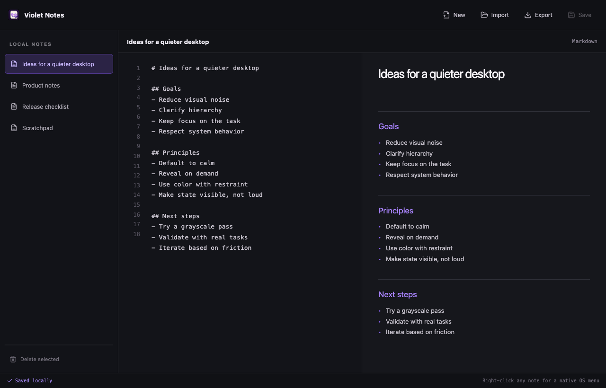

# Violet Notes

A local-first Markdown notes app showing what a focused Murasaki desktop app can look like.



- Native app menu and scoped native context menu
- Persistent local notes
- Markdown editor and live preview
- Markdown import and export

```bash
pnpm --filter violet-notes dev
pnpm --filter violet-notes installer
```

This app owns its `js.murasaki.examples.violetnotes` identity and dedicated
Notes icon; it is packaged independently from the other examples.

The implementation follows [`design/concept.png`](./design/concept.png).
